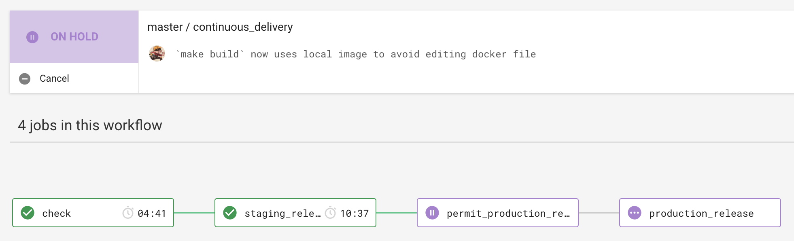

# Releasing

We use a pull request workflow, where changes are made on a branch and approved by one or more other maintainers before the developer can merge into `master`.

Then we have an automated four step deployment process, which runs in CircleCI.

1. Automated tests (RSpec) and linting (Rubocop) are run to ensure the release is of good quality.
2. The app is deployed to staging automatically, where we check our latest changes work well.
3. We manually confirm a production deployment in the CircleCI workflow once we're happy with our changes in staging.
4. The app is deployed to production.

# Manual Redeployment

1. Browse to the `master` branch on GitHub.
2. Browse to 'Commits'.
3. Locate and click the checks indicator for the commit you would like to deploy from.
4. Click a stage's 'Details' link.
5. Confirm the commit SHA is the same
  5.1. On Circle CI, the hash is shown on the right-hand side of the page, under 'Triggered by'.
  5.2. Compare this with the hash shown in the commits list.
6. Once you are happy, click 'Rerun workflow' on Circle CI.
7. There are **manual stages** that need to be triggered within the workflow.
Remember to do this, or the new workflow/deployment will not make it to production.
